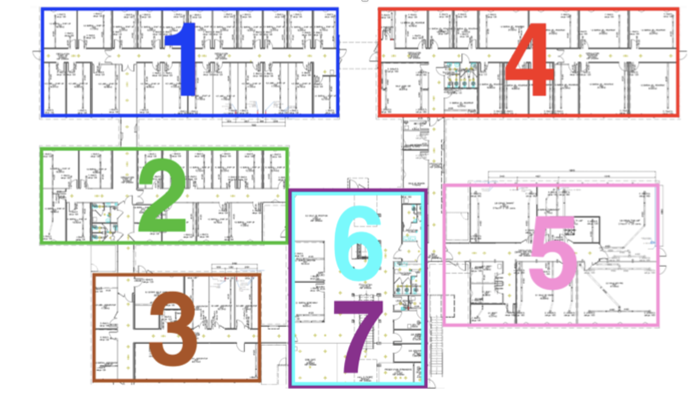
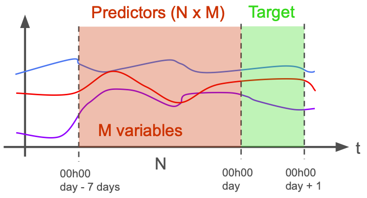

# E4C Challenge 2024 Data and Sample Scripts

## Data

Data are included from (and described in Table 1):

- SIRTA Observatory meteorological observations (600m northwest of Drahi-X; denoted by the "<sup>*</sup>" in the table)
- Drahi-X production and consumption data (with PV rooftop installation on Drahi-X; PV installation capacity is 16.7 kWp)
- Laboratory building rooftop installation (300m west of Drahi-X; denoted by the "<sup>**</sup>" in the table)

You are provided with the hourly time series of 27 variables for the years of 2022 and 2023 in the file `students_drahi_production_consumption_hourly.csv`:

- 14 consumption 
- 1 production
- 12 meteorological

Table: Here's a table of the variable names, their units, and their description (note the superscripts). Zone 1 and 2 refer to the zoning of Drahi-X found in Figure 1.

| Variable                     | Units               | Description                                                                        |
| :--                          | :-                  | :----                                                                              |
| datetime                     | YYYY-MM-DD HH:MM:SS | Time stamp (UTC)                                                                   |
| AirTemp                      | C                   | Air temperature at 2m above the ground<sup>*</sup>                                 |
| Diffuse_Solar_Flux           | W/m<sup>2</sup>     | Solar/shortwave downward diffuse irradiance (DHI)<sup>**</sup>                     |
| Direct_Solar_Flux            | W/m<sup>2</sup>     | Solar/shortwave downward direct irradiance (DNI)<sup>**</sup>                      |
| Downwelling_IR_Flux          | W/m<sup>2</sup>     | Downward infrared irradiance<sup>**</sup>                                          |
| Global_Solar_Flux            | W/m<sup>2</sup>     | Solar global horizontal irradiance (diffuse + direct solar flux; GHI)<sup>**</sup> |
| PAC                          | W                   | Total power generated by the PV installation                                       |
| SAA                          | deg.                | Solar azimuth angle<sup>**</sup>                                                   |
| SZA                          | deg.                | Solar zenith angle<sup>**</sup>                                                    |
| TGBT [kW]                    | kW                  | Total building consumption                                                         |
| kw_heater_corridor1_zone1    | kW                  | Power consumption of heaters in corridor of Zone 1                                 |
| kw_heaters_corridor_zone2    | kW                  | Power consumption of heaters in corridor of Zone 2                                 |
| kw_heaters_toilets_zone2     | kW                  | Power consumption of heaters in the bathrooms of Zone 2                            |
| kw_heatingcoolingtotal_zone1 | kW                  | Power consumption of air conditioning and heating of Zone 1 (includes heat pumps)  |
| kw_heatingcoolingtotal_zone2 | kW                  | Power consumption of air conditioning and heating of Zone 2 (includes heat pumps)  |
| kw_lights_zone1              | kW                  | Power consumption of Zone 1 lights                                                 |
| kw_lights_zone2              | kW                  | Power consumption of Zone 2 lights                                                 |
| kw_total_zone1               | kW                  | Total power consumption of Zone 1                                                  |
| kw_total_zone2               | kW                  | Total power consumption of Zone 2                                                  |
| kw_ventilation_zone1         | kW                  | Power consumption of Zone 1 ventilation                                            |
| kw_ventilation_zone2         | kW                  | Power consumption of Zone 2 ventilation                                            |
| kw_water_heater_zone2        | kW                  | Power consumption of water heater in Zone 2                                        |
| plugs_zone2                  | kW                  | Power consumption through electrical outlets of Zone 2                             |
| pres                         | hPa                 | Air pressure at 2m above the ground<sup>*</sup>                                    |
| rain                         | mm                  | Precipitation<sup>*</sup>                                                          |
| rh                           | %                   | Relative humidity at 2m above the ground<sup>*</sup>                               |
| wd                           | deg.                | Wind direction at 10m above the ground<sup>*</sup>                                 |
| ws                           | m/s                 | Wind speed at 10m above the ground<sup>*</sup>                                     |

{ width=500px }

The missing data points in `students_drahi_production_consumption_hourly.csv` are the times we have kept for the pedagogical team to evaluate the models with. You are also provided a mask that shows the locations of the removed data points: `nan_mask_drahi_production_consumption_hourly.csv`

## Scripts

The scripts we have included for guidance/inspiration are:

- `challenge_utils.py`: contains helper functions for saving your model in the proper format, data handling, etc.
- `example_model.py`: builds a simple linear model with `scikit-learn` for your edification
- `check_model.py`: a check script to make sure your model can be loaded and run
- `sample_view_time_series.py`: a sample script to crudely plot the time series of the provided data

To run these scripts successfully, you will need [`python 3`](https://www.python.org/downloads/) and the following python packages (tested versions in parentheses):

- [`pandas`](https://pandas.pydata.org/) (1.5.3)
- [`matplotlib`](https://matplotlib.org/) (3.7.0)
- [`numpy`](https://numpy.org/) (1.24.2)
- [`sklearn-onnx`](https://onnx.ai/sklearn-onnx/) (1.15.0)
- [`onnxruntime`](https://onnxruntime.ai/) (1.16.3)
- [`scikit-learn`](https://scikit-learn.org/stable/) (1.2.1)

## Building the Train/Test Datasets

In the `challenge_utils.py`, you'll find a function (`build_training_data`) that builds the "predictor" and "target" arrays to be used for your model training, visualized below:

{ width=500px }

Essentially, for every calender day (00h00 UTC to 24h00 UTC; shown as the green area in Figure 2), the total energy consumption of Zone 2 is calculated:

$$
\mathrm{target} = \int_{\mathrm{day}}^{\mathrm{day}+1} \mathrm{kw\_total\_zone2} \; dt
$$

And then converted to kilowatt-hours (kWh). This daily energy consumption is the target value. The predictors are all the variables from the prior 7 days from the beginning of the target day (00h00 UTC; shown as red in Figure 2). This means that M and N in Figure 2 equal 27 (for 27 variables) and 168 (for 7 x 24 data points per each variable).

## Saving Your Model

We will be expecting the model provided in `.onnx` format. [ONNX](https://onnx.ai/index.html) is an open, multiplatform model format that allows easy sharing of trained models. We have provided helper functions in `challenge_utils.py` so that you can easily save a `scikit-learn` model to the `.onnx` format. If you choose to use something other than `scikit-learn`, you will have to make your own save function and make sure it passes the `check_model.py` script by running it as so:

```
python check_model.py path/to/your_saved_model_file.onnx
```

**We will disqualify any model that cannot pass the `check_model.py` check!**

This means that your model must accept an input of the shape (D,4536) for the predictors, where D is variable in size, as 4536 is 7 days' worth of hourly time series data for 27 variables (7 x 24 x 27 = 4536). It must also output a prediction of the shape (D), to be consistent with the input.

If you choose not to use `scikit-learn`, there is a [great resource for saving many machine learning framework models into the `.onnx` format.](https://github.com/onnx/tutorials)

**Make sure that the model is saved for CPU execution and the input expected is in float 32 bit.** The `.onnx` format doesn't consistently support non 32 bit float data types yet.

## Model Evaluation

To determine the effectiveness of your model, we will be using the relative squared error (RSE) with the data that we have withheld from you:

$$
RSE = \frac{\sum_{i=1}^n (p_i - a_i)^2}{\sum_{i=1}^n (\overline{a} - a_i)^2}
$$

Where $p_i$ is the prediction, $a_i$ is the actual value, and $\overline{a}$ is the mean value of the $n$ values. This is provided in the `challenge_utils.py` script as the `relative_squared_error` function.

**We will be using this error calculation method to score your models and select the best fit one (lower is better)!** Therefore, we recommend you do the same as you build and train your models.

## Questions

Please bring up any questions you have at the dedicated office hours allotted each week. **Response outside these hours is not guaranteed and unlikely** (we be busy y'all).
